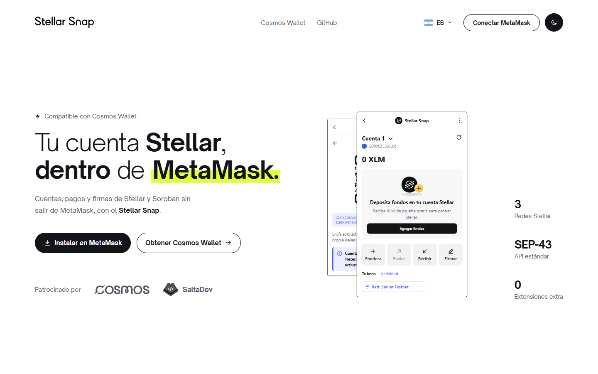
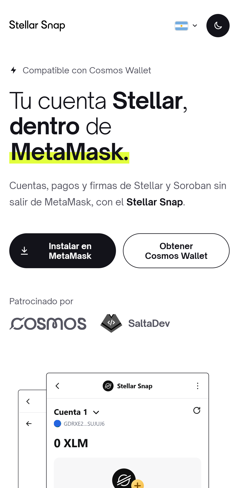
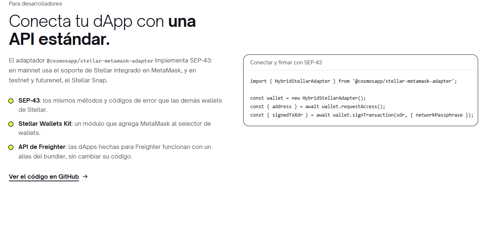

<p align="center">
  
</p>

<h1 align="center">Stellar Snap</h1>

<p align="center">
  <strong>Cuentas, pagos, canjes y firmas de Stellar y Soroban, sin salir de MetaMask.</strong><br>
  Sin otra extensión ni otra frase secreta: la wallet que ya usas, ahora en la red Stellar.
</p>

<p align="center">
  <a href="https://www.npmjs.com/package/@cosmosapp/stellar-snap"></a>
  <a href="https://www.npmjs.com/package/@cosmosapp/stellar-metamask-adapter"></a>
  <a href="LICENSE"></a>
  <a href="docs/integracion.md"></a>
  
  
</p>

<p align="center">
  <a href="https://snap.cosmospay.lat">Sitio web</a> ·
  <a href="#instalación">Instalar</a> ·
  <a href="docs/integracion.md">Integrar en tu dApp</a> ·
  <a href="docs/guia.md">Guía de uso</a> ·
  <a href="#donaciones">Donar</a>
</p>

---

## ¿Qué es?

**Stellar Snap** es un [Snap de MetaMask](https://metamask.io/snaps/) de código abierto que suma
cuentas de Stellar y Soroban a MetaMask, con su propia pantalla dentro de la extensión. Tus usuarios
envían, reciben, canjean y firman con la wallet que ya tienen; tu dApp se conecta con una API
estándar.

<p align="center">
  <picture>
    <source media="(prefers-color-scheme: dark)" srcset="docs/images/sitio-oscuro.png">
    
  </picture>
</p>

> Stellar Snap es un producto independiente de Cosmos Pay y Cosmos: no está afiliado, patrocinado
> ni aprobado por MetaMask, Consensys ni la Stellar Development Foundation.

## Funciones

| | |
| --- | --- |
| 👤 **Cuentas Stellar**<br>Varias cuentas a partir de tu frase secreta de MetaMask, o importa una clave o una frase de recuperación. | 📤 **Enviar y recibir**<br>XLM y otros activos, revisando comisión y memo antes de firmar; recibe con un QR. |
| 🪙 **Activos y trustlines**<br>Agrega activos del registro de Cosmos Pay o cualquiera por código y emisor. | 🔁 **Canjes**<br>En el DEX de Stellar con cotizaciones de Cosmos Pay; el Snap verifica cada transacción antes de firmar. |
| ✍️ **Soroban y mensajes**<br>Firma autorizaciones de contratos viendo contrato, función y argumentos; mensajes con SEP-53. | 🔗 **Cuenta EVM vinculada**<br>Une tu dirección `0x` con tu cuenta Stellar con firmas que cualquiera puede verificar. |

<p align="center">
  
  &nbsp;&nbsp;
  
</p>

## Instalación

1. Instala [MetaMask](https://metamask.io/download/) en tu navegador de escritorio.
2. Abre el [sitio](https://snap.cosmospay.lat) y pulsa **Instalar en MetaMask**. Aprueba los
   permisos que muestra MetaMask.
3. En MetaMask, abre el menú ⋮ → **Snaps** → **Stellar Snap**. Desde ahí envías, recibes, canjeas y
   administras tus cuentas. La [guía de uso](docs/guia.md) explica cada pantalla.

> Mientras MetaMask revisa el Snap para su lista de Snaps permitidos, se instala en
> [MetaMask Flask](https://metamask.io/flask/).

### Redes

| Red | Quién firma |
| --- | --- |
| **Mainnet** | El soporte de Stellar integrado en MetaMask; si tu versión no lo tiene, el Stellar Snap. |
| **Testnet** | El Stellar Snap, con XLM gratis de Friendbot. |
| **Futurenet** | El Stellar Snap, con XLM gratis de Friendbot. |

## Para desarrolladores

Conecta tu dApp a MetaMask con la misma API que el resto de las wallets de Stellar:

```bash
npm install @cosmosapp/stellar-metamask-adapter
```

```ts
import { HybridStellarAdapter } from '@cosmosapp/stellar-metamask-adapter';

const wallet = new HybridStellarAdapter();
const { address } = await wallet.requestAccess();
const { signedTxXdr } = await wallet.signTransaction(xdr, { networkPassphrase });
```

- **SEP-43**: los mismos métodos y códigos de error que las demás wallets de Stellar.
- **Stellar Wallets Kit**: un módulo que agrega MetaMask al selector de wallets.
- **API de Freighter**: las dApps hechas para Freighter funcionan con un alias del bundler.

La [documentación de integración](docs/integracion.md) cubre la arquitectura, los tres modos y la
API JSON-RPC completa del Snap.

<p align="center">
  
</p>

## Seguridad y privacidad

- **Tus claves no salen de MetaMask.** Las cuentas se derivan con SEP-0005 de tu frase secreta; de
  una cuenta importada solo se guarda la clave, cifrada por MetaMask. La frase nunca se almacena.
- **Revisas todo antes de firmar.** Cada pago, firma, cambio de red o vínculo pide tu confirmación,
  con el contrato y los argumentos de Soroban decodificados.
- **Canjes verificados.** El Snap rechaza cualquier transacción de canje que no sea exactamente la
  cotizada: tu cuenta como origen, al menos el mínimo a recibir y, como mucho, una comisión.
- **Sin custodia y sin servidores con tus datos.** Lee la [política de privacidad](https://snap.cosmospay.lat/privacy/).
  Para reportar una vulnerabilidad, escribe a [contact@cosmospay.lat](mailto:contact@cosmospay.lat)
  en lugar de abrir un issue.

## Donaciones

Stellar Snap es gratis y de código abierto. Si te resulta útil, puedes apoyarlo con una donación en
la red pública de Stellar a esta cuenta, o con el QR de la sección **Donaciones** del
[sitio](https://snap.cosmospay.lat/#donate):

```text
GARMB7W3FCR3GKIM3FLWVJASC2PUZ4VHUJZTNJVWWKNTCJNKO6TBCT76
```

Cada aporte financia auditorías, mantenimiento y nuevas funciones.

## Configuración

Cada paquete lee un `.env` opcional; los ejemplos documentan cada variable:

```bash
cp packages/site/.env.example packages/site/.env   # dominio, donaciones, Google Analytics, buscadores, IndexNow
cp packages/snap/.env.example packages/snap/.env   # claves de la API de Cosmos Pay
```

| Variable | Paquete | Para qué |
| --- | --- | --- |
| `VITE_SITE_URL` | sitio | Dominio público (se detecta solo en Vercel, Netlify, Cloudflare Pages y Render). |
| `VITE_SNAP_ID` | sitio | Snap que instala el botón (por defecto `npm:@cosmosapp/stellar-snap`). |
| `VITE_DONATION_ADDRESS` · `VITE_DONATION_URL` | sitio | Activan la sección de donaciones. |
| `VITE_GA_MEASUREMENT_ID` | sitio | Google Analytics 4, solo con el consentimiento del visitante. |
| `VITE_*_VERIFICATION` | sitio | Verificación en Google, Bing, Yandex, Baidu, Naver y Seznam. |
| `INDEXNOW_KEY` | sitio | Indexación inmediata en Bing, Yandex, Naver y Seznam. |
| `COSMOS_API_KEY_TESTNET` · `COSMOS_API_KEY_MAINNET` | snap | Claves propias de la API de Cosmos Pay. |

Detalles, comandos y pasos de publicación: [docs/desarrollo.md](docs/desarrollo.md).

## Desarrollo

```bash
npm install
npm start          # Snap en :8080 (watch) + sitio en :5173
npm test           # Snap (unit + integración) + adaptador
npm run build      # Snap, adaptador y sitio estático en 7 idiomas
```

| Paquete | npm | Qué es |
| --- | --- | --- |
| [`packages/snap`](packages/snap) | `@cosmosapp/stellar-snap` | El Snap de MetaMask: API `stellar_*` y la pantalla dentro de MetaMask. |
| [`packages/adapter`](packages/adapter) | `@cosmosapp/stellar-metamask-adapter` | Adaptador SEP-43, módulo de Stellar Wallets Kit y API compatible con Freighter. |
| [`packages/site`](packages/site) | — | Sitio en 7 idiomas: presentación, dApp de demo y páginas legales. |

Las convenciones del código y los puntos de extensión están en [`CLAUDE.md`](CLAUDE.md).

## Patrocinadores

<p>
  <a href="https://cosmospay.lat"><strong>Cosmos</strong></a> · Cosmos Pay y Cosmos Wallet<br>
  <a href="https://salta.dev"><strong>SaltaDev</strong></a> · la comunidad de desarrolladores de Salta
</p>

## Contribuir

¿Encontraste un error o tienes una idea? Abre un [issue](https://github.com/CosmosPay/Cosmos-Metamask-Adapter/issues)
o un pull request. Antes de enviarlo, corre `npm test` y `npm run typecheck`.

## Licencia

[MIT](LICENSE) © Cosmos Pay. Los nombres y logos de MetaMask, Stellar y Cosmos pertenecen a sus
dueños y no están incluidos en la licencia.
