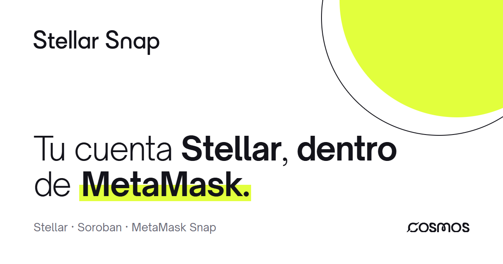
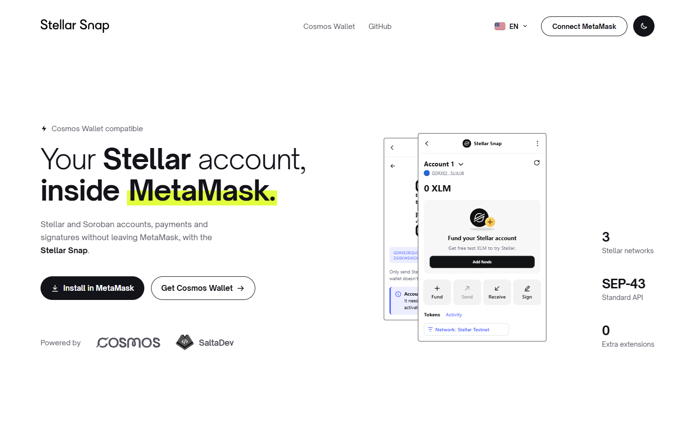
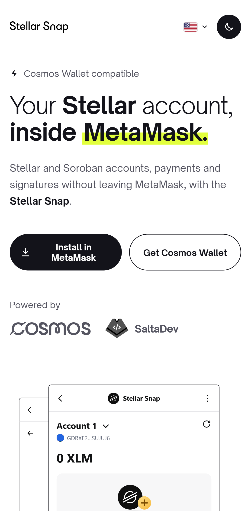
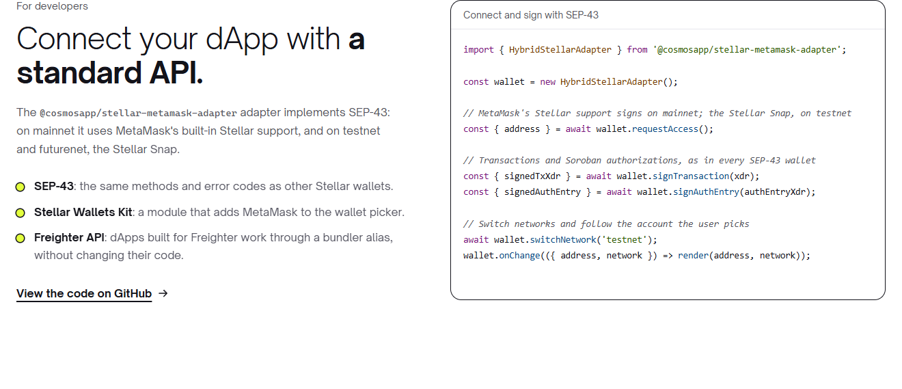

<p align="center">
  
</p>

<h1 align="center">Stellar Snap</h1>

<p align="center">
  <strong>Stellar and Soroban accounts, payments, swaps and signatures without leaving MetaMask.</strong><br>
  No other extension, no other secret phrase: the wallet you already use, now on the Stellar network.
</p>

<p align="center">
  <a href="https://github.com/CosmosPay/Stellar-Snap/actions/workflows/ci.yml"></a>
  <a href="https://www.npmjs.com/package/@cosmosapp/stellar-snap"></a>
  <a href="https://www.npmjs.com/package/@cosmosapp/stellar-metamask-adapter"></a>
  <a href="LICENSE"></a>
  <a href="docs/integration.md"></a>
  
  
</p>

<p align="center">
  <a href="https://snap.cosmospay.lat/en/">Website</a> ·
  <a href="#installation">Install</a> ·
  <a href="docs/integration.md">Add it to your dApp</a> ·
  <a href="docs/guide.md">User guide</a> ·
  <a href="#donations">Donate</a>
</p>

---

## What is it?

**Stellar Snap** is an open-source [MetaMask Snap](https://metamask.io/snaps/) that adds Stellar and
Soroban accounts to MetaMask, with its own screen inside the extension. Your users send, receive,
swap and sign with the wallet they already have; your dApp connects through a standard API.

<p align="center">
  <picture>
    <source media="(prefers-color-scheme: dark)" srcset="docs/images/site-dark.png">
    
  </picture>
</p>

> Stellar Snap is an independent product of Cosmos Pay and Cosmos: it isn't affiliated with,
> sponsored or endorsed by MetaMask, Consensys or the Stellar Development Foundation.

## Features

| | |
| --- | --- |
| 👤 **Stellar accounts**<br>Several accounts from your MetaMask Secret Recovery Phrase, or import a secret key or a recovery phrase. | 📤 **Send and receive**<br>XLM and other assets, reviewing the fee and memo before signing; receive with a QR code. |
| 🪙 **Assets and trustlines**<br>Add assets from the Cosmos Pay registry, or any other by its code and issuer. | 🔁 **Swaps**<br>On the Stellar DEX with Cosmos Pay quotes; the Snap checks every transaction before signing. |
| ✍️ **Soroban and messages**<br>Sign contract authorizations seeing the contract, function and arguments; messages with SEP-53. | 🔗 **Linked EVM account**<br>Link your `0x` address to your Stellar account with signatures anyone can verify. |

<p align="center">
  
  &nbsp;&nbsp;
  
</p>

## Installation

1. Install [MetaMask](https://metamask.io/download/) in your desktop browser.
2. Open the [website](https://snap.cosmospay.lat/en/) and click **Install in MetaMask**. Approve the
   permissions MetaMask shows you.
3. In MetaMask, open the ⋮ menu → **Snaps** → **Stellar Snap**. From there you send, receive, swap
   and manage your accounts. The [user guide](docs/guide.md) walks through every screen.

> While MetaMask reviews the Snap for its allowlist, it installs in
> [MetaMask Flask](https://metamask.io/flask/).

### Networks

| Network | Who signs |
| --- | --- |
| **Mainnet** | MetaMask's built-in Stellar support; if your version doesn't have it, the Stellar Snap. |
| **Testnet** | The Stellar Snap, with free XLM from Friendbot. |
| **Futurenet** | The Stellar Snap, with free XLM from Friendbot. |

## For developers

Connect your dApp to MetaMask with the same API as every other Stellar wallet:

```bash
npm install @cosmosapp/stellar-metamask-adapter
```

```ts
import { HybridStellarAdapter } from '@cosmosapp/stellar-metamask-adapter';

const wallet = new HybridStellarAdapter();
const { address } = await wallet.requestAccess();
const { signedTxXdr } = await wallet.signTransaction(xdr, { networkPassphrase });
```

- **SEP-43**: the same methods and error codes as other Stellar wallets.
- **Stellar Wallets Kit**: a module that adds MetaMask to the wallet picker.
- **Freighter API**: dApps built for Freighter work through a bundler alias.

The [integration docs](docs/integration.md) cover the architecture, the three modes and the Snap's
full JSON-RPC API.

<p align="center">
  
</p>

## Security and privacy

- **Your keys never leave MetaMask.** Accounts are derived from your Secret Recovery Phrase with
  SEP-0005; for an imported account only its secret key is stored, encrypted by MetaMask. The phrase
  is never stored.
- **You review everything before signing.** Every payment, signature, network switch or link asks
  for your confirmation, with Soroban contracts and arguments decoded.
- **Verified swaps.** The Snap rejects any swap transaction that isn't exactly the one quoted: your
  account as the source, at least the minimum to receive and, at most, one fee.
- **No custody and no servers holding your data.** Read the
  [privacy policy](https://snap.cosmospay.lat/en/privacy/). To report a vulnerability, email
  [contact@cosmospay.lat](mailto:contact@cosmospay.lat) instead of opening an issue.

## Donations

Stellar Snap is free and open source. If it's useful to you, you can support it with a donation on
the Stellar public network to this account, or with the QR code in the **Donate** section of the
[website](https://snap.cosmospay.lat/en/#donate):

```text
GARMB7W3FCR3GKIM3FLWVJASC2PUZ4VHUJZTNJVWWKNTCJNKO6TBCT76
```

It accepts XLM and other Stellar assets, such as USDC, on mainnet. Don't send testnet funds or funds
from other blockchains. Every contribution funds audits, maintenance and new features.

## Configuration

Each package reads an optional `.env`; the examples document every variable:

```bash
cp packages/site/.env.example packages/site/.env   # domain, donations, Google Analytics, search engines, IndexNow
cp packages/snap/.env.example packages/snap/.env   # Cosmos Pay API keys
```

| Variable | Package | What for |
| --- | --- | --- |
| `VITE_SITE_URL` | site | Public domain (detected automatically on Vercel, Netlify, Cloudflare Pages and Render). |
| `VITE_SNAP_ID` | site | Snap the install button installs (default `npm:@cosmosapp/stellar-snap`). |
| `VITE_DONATION_ADDRESS` · `VITE_DONATION_URL` | site | Turn on the donations section. |
| `VITE_GA_MEASUREMENT_ID` | site | Google Analytics 4, only with the visitor's consent. |
| `VITE_*_VERIFICATION` | site | Ownership verification for Google, Bing, Yandex, Baidu, Naver and Seznam. |
| `INDEXNOW_KEY` | site | Instant indexing on Bing, Yandex, Naver and Seznam. |
| `COSMOS_API_KEY_TESTNET` · `COSMOS_API_KEY_MAINNET` | snap | Your own Cosmos Pay API keys. |

Details, commands and publishing steps: [docs/development.md](docs/development.md).

## Development

```bash
npm install
npm start          # Snap on :8080 (watch) + website on :5173
npm test           # Snap (unit + integration) + adapter
npm run build      # Snap, adapter and the static website in 7 languages
```

| Package | npm | What it is |
| --- | --- | --- |
| [`packages/snap`](packages/snap) | `@cosmosapp/stellar-snap` | The MetaMask Snap: the `stellar_*` API and its screen inside MetaMask. |
| [`packages/adapter`](packages/adapter) | `@cosmosapp/stellar-metamask-adapter` | SEP-43 adapter, Stellar Wallets Kit module and Freighter-compatible API. |
| [`packages/site`](packages/site) | — | Website in 7 languages: landing page, demo dApp and legal pages. |

Every push and pull request runs the tests on GitHub Actions. Merging into `master` publishes to
npm each package whose version was bumped, and the website follows within minutes: our server
deploys `master` by itself, and GitHub Pages keeps a fallback copy; see
[docs/development.md](docs/development.md#continuous-integration-and-deployment).

Code conventions and extension points are in [`CLAUDE.md`](CLAUDE.md).

## Sponsors

<p>
  <a href="https://cosmospay.lat"><strong>Cosmos</strong></a> · Cosmos Pay and Cosmos Wallet<br>
  <a href="https://salta.dev"><strong>SaltaDev</strong></a> · the developer community of Salta
</p>

## Contributing

Found a bug or have an idea? Open an [issue](https://github.com/CosmosPay/Stellar-Snap/issues)
or a pull request. Before sending it, run `npm test`, `npm run typecheck` and `npm run format:check`,
as CI does, and add a changeset (`npx changeset`) if it changes the Snap or the adapter: it becomes
the [changelog](https://snap.cosmospay.lat/en/changelog/).

## License

[MIT](LICENSE) © Cosmos Pay. The MetaMask, Stellar and Cosmos names and logos belong to their owners
and aren't covered by the license.
