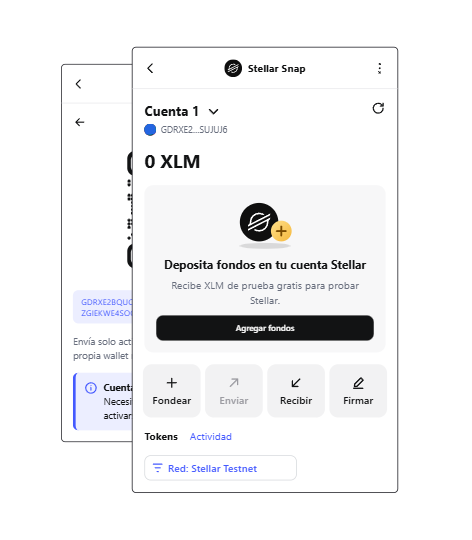

# Guía de uso

Todo se hace desde la pantalla del Snap dentro de MetaMask: menú ⋮ → **Snaps** → **Stellar Snap**.

## La pantalla principal

- **Cuentas** (como en MetaMask): "Cuenta 1 ⌄" arriba con la dirección y su avatar; abre la
  lista de cuentas con saldo, menú ⋮ (usar, copiar dirección, eliminar) y "Agregar cuenta".
  Eliminar solo oculta la cuenta: las claves salen de la frase secreta, así que al añadir de
  nuevo vuelve la misma cuenta con sus fondos. Siempre queda al menos una. Las dApps firman con
  la cuenta seleccionada y no pueden usar cuentas eliminadas.
- **Red**: píldora "Red: Stellar Testnet" sobre la lista de tokens, que abre la lista de redes
  (Mainnet, Testnet, Futurenet). La elección se guarda.
- **Saldo** en XLM y lista de los demás activos (trustlines).
- **Enviar**: formulario → revisión (comisión, memo, aviso si se activa una cuenta nueva) →
  envío → enlace al explorador. Valida el saldo gastable, descontando la reserva mínima de Stellar.
- **Recibir**: QR y dirección para copiar.
- **Fondear**: solo aparece mientras la cuenta no está activada. En testnet/futurenet pide XLM
  gratis a Friendbot con un clic; en mainnet explica cómo retirar XLM desde un exchange.
- **Saldo y rendimiento**: en mainnet, valor total en la moneda de MetaMask con su variación de
  24 h (`-USD 0,02 (-0,66 %)`); en redes de prueba, la variación del precio de XLM. Precios de la
  API de precios de MetaMask (`price.api.cx.metamask.io`) con CoinGecko como respaldo.
- **Tokens**: logo oficial (CDN de iconos de MetaMask) con un circulito del emisor en la esquina
  (Circle, Aquarius…). Los activos verificados muestran el emisor ("Circle") en vez de su dirección.
- **Activos (trustlines)**: selector con los activos del registro de Cosmos Pay (`+` para añadir,
  `✓` para quitar) y "Otro activo" para código + emisor. Eliminar exige saldo 0 y libera la
  reserva de 0,5 XLM.

La pantalla imita la página principal de MetaMask: tarjetas Fondear / Enviar / Recibir, bloque
"Agregar fondos" para cuentas nuevas, pestañas Tokens / Actividad y valor en la moneda de MetaMask
(solo mainnet, y solo si tienes activados los precios externos). Snaps no permite dar estilo a los
botones, así que las tarjetas y la píldora son SVG dentro de botones. Siguen el modo claro/oscuro
del sistema o del navegador.

## Importar cuentas

En *Cuentas → Importar cuenta* se puede pegar una clave secreta de Stellar (`S…`) o una frase de
recuperación BIP-39 de 12/24 palabras (con número de cuenta opcional, derivada en
`m/44'/148'/{n}'` como cualquier wallet SEP-0005). Solo se guarda la clave secreta resultante, en
el estado cifrado del Snap (`snap_manageState`); la frase nunca se almacena. Al eliminar una cuenta
importada su clave se borra (las derivadas de MetaMask solo se ocultan).

## Canjear (swaps nativos de Stellar)

Mismo motor que la Cosmos Wallet: el servidor comunitario cotiza (`POST /v1/swaps/quote`, ruta
*strict-send* en el DEX/AMM de Stellar + comisión y slippage), construye la transacción
(`POST /v1/swaps`) y la retransmite (`POST /v1/swaps/:id/submit`). Antes de firmar, el Snap
comprueba que el XDR del servidor es exactamente el canje revisado: origen = tu cuenta, como mucho
un pago de comisión a la wallet anunciada y una `pathPaymentStrictSend` hacia ti con al menos el
mínimo cotizado; si no, no firma nada. No hay ruta alternativa directa al DEX: un canje que no pase
por el servidor no cobraría la comisión, así que si la pasarela no responde el Snap muestra
«canjes no disponibles». Futurenet no tiene canjes (el servidor no la sirve).

## Registro de activos de Cosmos Pay

El listado principal de activos sale de
`GET https://api.cosmospay.lat/cosmos-api/v1/assets?network=public|testnet`, con la clave pública
compartida que el Snap obtiene en ejecución de `GET /v1/public-key`. La pasarela limita cada clave
a su entorno (`dev` → testnet, `prod` → mainnet), así que los canjes solo usan la clave de su
propia red; se puede fijar una por red al compilar (ver [Desarrollo](desarrollo.md#variables-de-entorno)).
Si la pasarela no responde, usa la copia incluida del registro (versión 2) y reintenta al minuto,
igual que la wallet de Cosmos Pay. Para que el Snap pueda llamar a la API en vivo, la pasarela tiene
que permitir CORS para el origen `null` (los Snaps hacen `fetch` desde un origen opaco).

## Idioma

Sigue el de MetaMask (`snap_getPreferences`): inglés, español y portugués; cualquier otro cae a
inglés. Los números usan los separadores del idioma (`2,5` / `2.5`) y se respeta "ocultar saldos".
Para añadir un idioma, copia `packages/snap/locales/en.json`, tradúcelo y regístralo en
`src/i18n.ts` y en `source.locales` del manifiesto.

## Logo

El logo es el monograma oficial de Stellar, extraído sin modificar del vector del press kit de la
Stellar Development Foundation (stellar.org/brand-resources, 2026), con sus colores de marca
(`#0F0F0F`).
